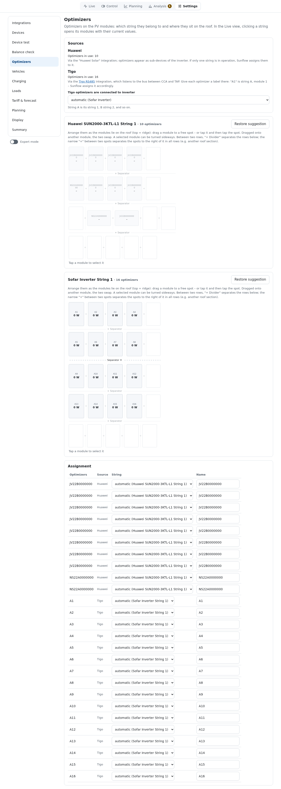
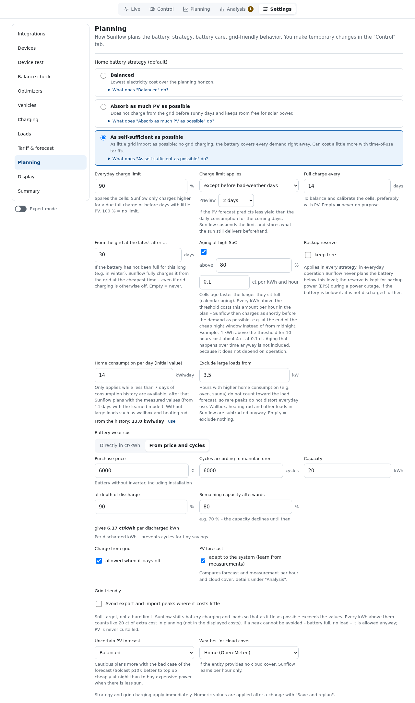
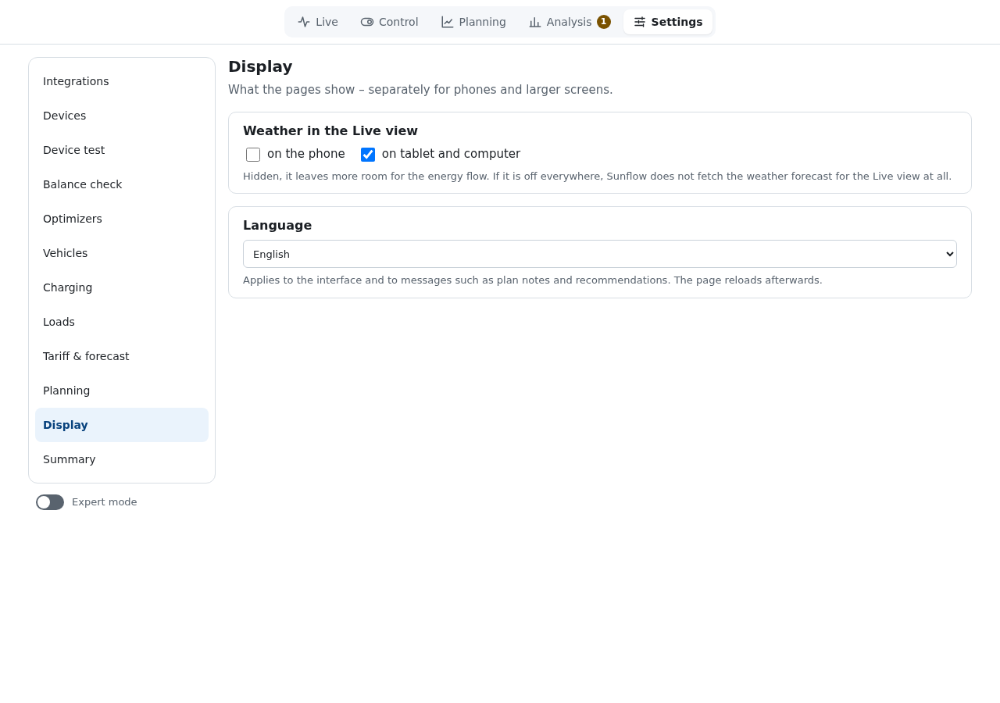

# Settings

[Deutsch](../einstellungen.md) · **English**

The settings are split into areas; on first start Sunflow walks through them in order (see
[Installation and setup](installation.md)). Unsaved changes in one area are kept when you switch
to another.

**Search** (box above the list) finds a setting by its name, by other words for it ("battery",
"backup", "Tibber", "export limit"), despite typos, and your devices by name. A result opens the
area, scrolls to the setting and highlights it briefly. Arrow keys and Enter choose, Esc clears
the box.

**Expert mode** (switch below the list) additionally shows entity, unit, factor,
sign, decimals, polling interval and RAM/flash per role. These values are stored as deviations
from the profile. The browser remembers the switch.

## Integrations, devices, device test, balance check

Described in [Installation and setup](installation.md).

## Optimizers

Sources, arrangement on the roof and assignment of module optimizers: see [Optimizers](optimizers.md).

## Vehicles

What the car is, independent of the wallbox:

- **Name**, **Battery capacity (usable)** and **Charging efficiency**.
- **State of charge**: the sensor from the car's integration. **Estimate between reports** (on by
  default): many cars send their state of charge only now and then, e.g. a Fiat 500e through its
  cloud. In between, Sunflow adds what the wallbox charged into this car since. With every new
  report it compares the estimate with the real value and learns how much of the wallbox's energy
  reaches the battery (first the charging efficiency, then learned, over roughly the last 60 kWh).
  It only learns from reports after at least 1.5 kWh, not at 100 % and not when the car was driven
  in between. Estimated values show with "≈"; the vehicle's card shows the last report, what was
  charged since and what was learned.
- **Plugged in / home** (optional, e.g. a `device_tracker`): Sunflow
  learns when the car usually comes home and leaves, and plans it as soon as it is at home.
  Without it, the plug-in times at the wallbox are used.
- **Maximum charging power single-phase** and **three-phase** (optional, e.g. Fiat 500e:
  7.4 kW / 11 kW). Sunflow never asks the wallbox for more current than the car takes, and plans
  with this power.
- **Protect 12 V battery**: with the car's voltage sensor the wallbox
  charges briefly at minimum current when the auxiliary battery drops below the limit (default
  12.2 V, charge for 5 min, then at least 60 min pause). Details in [Supported devices](devices.md).

From the state-of-charge history of the last four weeks Sunflow learns how much the car uses per
hour (weekdays and weekends separately, from 14 days of data).

## Charging

Per wallbox:

- **Which vehicles** may charge here.
- Per vehicle **Target SoC**, **Ready by (daily)**, **Charging** (Cost-optimal, PV surplus only or
  As fast as possible) and whether the **home battery may discharge into the car** (when off, the
  car charges from PV surplus or the grid only). These apply when the car is recognized without a
  card (sensor, selection under Control, the only vehicle).
- **Cards** (wallboxes with RFID): a vehicle can have several cards, each with its own number,
  name and values as above. When a card is scanned its values apply, e.g. a card "Holiday" with
  100 % by 7:00 and a card "Everyday" with 80 %. Its name is shown wherever "Card 3" would be. A
  number belongs to at most one card at a wallbox. When Sunflow recognizes the car without a card
  and releases the wallbox, it uses the vehicle's first card for that.
- **Vehicle detection**: in which order Sunflow detects the plugged-in
  car (card at the wallbox, selection under Control, the vehicle's sensor) and whether the wallbox
  releases charging without a card.

## Heat pump

The heat pump control runs in **shadow operation**: Sunflow computes the flow temperature and shows
it, but writes nothing to the heat pump – until you switch on **writing to the heat pump** per heat pump.

**Writing to the heat pump** (per heat pump, default off): switched on, Sunflow writes the set value (Max
T-Vorlauf, stored in the heat pump's EEPROM, within the budget) and the room thermostat block to the heat
pump. It can be switched on only when the heat pump is compatible and reachable, values are there, the
heating circuit function is fixed and the ESP regulation is off; switch off other controllers writing these
values first. When switched on, Sunflow takes over without writing anything: the base is frozen, the
correction starts at 0, set value and block count as the heat pump has them (a block set by someone else
stays someone else's). Sunflow writes only when the rules ask for it; every write is in the journal with its
reason. A write that fails is taken back (journal) and tried again when the rules ask for it. About a minute
after a write Sunflow checks that the heat pump took the value over: if it does not show it, Sunflow goes on
from the value shown; if the effective flow setpoint stays below it while heating, the heat pump limits it
itself (e.g. flow temperature day) – then set the upper limit of the set value to that value at most (both a
warning in the journal). In mode off Sunflow writes nothing; afterwards it takes over again as when switched
on. **Switching off** resets nothing: Max T-Vorlauf stays as last written, a block Sunflow set stays set (the
heat pump then does not heat until it is released); Sunflow computes in the shadow again.

**Room setpoint:** the room temperature Sunflow is to keep (18–27 °C) and the mode heat/off; the same as
the thermostat "Haus" in Home Assistant. Next to it the room temperature (weighted mean of the rooms; a
room does not count while its sensor is unavailable or has not reported for more than 2 hours).

**Airing:** when a room falls by at least 0.3 K within 30 minutes, Sunflow notices airing. Until the
room is steady again (changed by at most 0.1 K for 30 minutes), at most 2 hours, it does not count for
the room temperature and the correction pauses. Rooms being aired and the airing of the last 24 hours
are shown.

**Heat pump:** per device connection and compatibility, program, activity, strategy (HK function),
bypass valve, flow, return, effective flow setpoint and Max T-Vorlauf, an active room thermostat block or
a fault clearly highlighted, and whether the heat pump heats validly – otherwise why not (e.g. hot water,
after-run, bypass valve). Below it the **flow target** = base + correction: the base is the effective
flow setpoint from valid heating (outside it the last such value counts). The correction slowly evens
out the difference between room temperature and setpoint (at most ± 3 K; it does not grow within
± 0.2 K); how slowly depends on the heating surface type (integral time: underfloor 6 h, mixed 4 h,
radiators 2 h). It pauses while the heat pump does not heat validly, room temperatures are missing, a room is
being aired or the room is still following a changed setpoint (at most 24 hours). In shadow operation it has no effect back and
may run to its limit.

**Heating curve (shadow):** from the 5 minute values Sunflow learns every hour how much heat the heating
surfaces give off: Q = K · (mean water temperature − room temperature)^n, plus the spread (flow −
return) depending on the heat. n comes from the **heating surface type** (underfloor 1.1, mixed 1.2,
radiators 1.3); K and the spread are learned – only from valid heating with the compressor running for
at least 15 minutes, without after-run and without airing. The last two days are held back: the curve
counts as usable only when it predicts the flow there better than "the flow stays", its values are
plausible and there is enough data (at least 12 hours from 3 days for learning and 2 hours for checking).
K, n, spread, quality and amount of data are shown.

With a usable curve the flow target = curve + correction: the flow at which the heating surfaces give
off the heat needed at the room setpoint. The heat needed comes from the house model (once it is
usable), else from the mean heat of the last 3 hours (compressor pauses count as 0; hot water, defrost,
after-run, airing and the block do not count; at least 2 hours needed). That heat comes from the flow the
heat pump runs now – the curve then only follows the current state, the direction comes from the
correction. Otherwise base + correction still applies. The source in use is shown; when it changes, the
flow target jumps once in shadow operation, the correction stays. Once Sunflow writes for real, it shifts
the correction at such a change so the flow target does not jump (within the correction's limit of ±3 K;
a rest stays as a jump and is noted in the journal).

**Set value and protection (shadow):** From the flow target Sunflow computes the set value (Max
T-Vorlauf) it would write and the room thermostat block – shown as "would write", none of it goes to the
heat pump. The set value stays within the **limits of the set value**, which can be set per heat pump
(at least/at most; at most is also the highest flow for the screed or heating surfaces). Empty, the
start value of the heating surface type applies (underfloor 25–40 °C, mixed 25–50 °C, radiators
30–55 °C); the entity's range always narrows it further. A flow target more than 8 K away from the
effective flow setpoint (or the heating curve) would not be written (journal entry). When the flow
target reaches a limit or the heat pump its maximum or minimum output, the correction does not move
further beyond it.

The heat pump starts the compressor when the setpoint is at least 3 K above the flow, and stops it when
the flow is 3 K above the setpoint. So Sunflow would: in a pause raise the set value so that the heat
pump starts (flow + 3 K, or enough that the jump of the flow after the start does not stop it); during
hot water prepare the set value for the start afterwards; after a start hold it until the flow is calm,
then lower it once; while running follow it up when the flow comes close to the shutdown limit. Heat it
does not want (room 0.5 K above the setpoint, or the heat pump's minimum output above the need) it would
switch off with the room thermostat block – each state for at least 20 minutes. A room thermostat block
Sunflow did not set (by hand, an automation, another controller) is not released by Sunflow: it is shown
prominently in the heat pump section and noted in the journal, and Sunflow controls again only once it is
released. The swing of the flow
while running, the jump after a start (normal, after hot water, after defrost), the time until it is
calm and the heat pump's output range are learned from the recording; until there are enough data,
cautious start values apply. When the compressor stops unwantedly (flow 3 K above the setpoint without
block, hot water or defrost), the journal says so and the value concerned is raised at once; without
further incidents it goes back over weeks. The table **Writes per day** counts for the last 7 days what
Sunflow would have written (normal, start, tracking, block on/off) and the unwanted shutdowns – to
compare with the planned budget of 48 normal writes and 24 for start and tracking per day. The **minimum
spacing** between two writes of the set value already applies in shadow (from the device profile, for the
HPSU 5 minutes, for protection steps – start and tracking – 2 minutes): the first change after a calm
spell goes out at once, further changes within that time are only kept, and once it has passed Sunflow
writes the latest value if it still differs (a normal value by more than 0.5 K, a protection step with any
raise). A waiting value is shown as "pending … would be written at …". The **budget** applies in shadow
as well (from the device profile, for the HPSU 48 writes per day, plus 24 only for protection steps, at
most 6 in any hour; the day follows Home Assistant's time zone): Sunflow counts virtually from the
recorded writes, the counter of real EEPROM writes stays untouched; writing for real, the real writes in
that counter count. When the daily budget is used up, a
normal value waits ("pending … waits: daily budget used up") until the next day; protection steps go on
from the emergency quota. When that is used up too or the hourly limit is reached, Sunflow would set the
room thermostat block instead of the protection step and release it once a protection step may be
written again (at the earliest after its minimum duration). The journal notes each kind of exhaustion
once a day. The tile **Budget today** ("virtual" in the shadow) shows the day's use, the emergency quota left and the
last hour. The button **Write now** skips the spacing for the pending value (not the budget) and is not
offered in shadow operation yet. The room thermostat block counts neither against the
budget nor for the spacing: the HPSU does not store this input in its EEPROM; its minimum duration
prevents cycling.

**Foreign writers:** When Max T-Vorlauf changes at the heat pump without Sunflow having written it
(automation, script, ESP regulation, by hand), Sunflow reports it as a warning in the journal – once while
such changes follow each other; further ones it only counts. It counts as over only 24 hours after the
last change (journal entry); until then the setup summary names the heat pump as well. Sunflow assumes the
new value from then on (in shadow also for the virtual writes) and waits for the minimum spacing before
writing again itself; foreign changes do not count against its budget. While the **ESP regulation** of the
CAN component is active ("Vorlauf Soll Geregelt" above 0), the component regulates Max T-Vorlauf itself:
Sunflow then writes nothing (in shadow "Would write nothing: ESP regulation active"), reports it in the journal and the
summary, and controls again once the value is set to 0 in ESPHome.

**House:** room temperatures (one or more sensors, optionally weighted, e.g. by area) and
optionally the heat into the house (e.g. the heating's heat meter, otherwise the heat pump's heat).
The **heating surface type** (underfloor heating, mixed, radiators; default underfloor) sets the start
value of the heating curve and the integral time of the correction; after a change the curve is
evaluated anew, the measured data are kept and the correction does not jump.
The **outside temperature** can be chosen: automatic (own sensor under learning sources, else the heat
pump's sensor), the heat pump's outside temperature sensor, the sensor of its outdoor unit (HPSU: TA2)
or only the own sensor. From the hourly values of the last four weeks Sunflow learns a simple thermal
model of the house. Hours in which the heat pump made hot water or defrosted are left out – their heat
did not go into the house. The hourly values first come from Home Assistant's hourly means; once the
heat pump's recording holds at least 7 days of valid heating (at least 1 hour each), from its 5 minute
values – then without hours with hot water, defrost, after-run or airing. The switch happens only when
the model from them is not worse; after that it stays. The source in use is shown under "Learned":

| Learned | Meaning |
|---|---|
| Time constant | hours until two thirds of the difference to outside are gone |
| Cooling at 0 °C outside | kelvin per hour lost at 20 °C inside without heating and sun |
| Heat loss | heating power per kelvin of difference (only with heat measurement) |
| Heat storage | heat for 1 K warmer in the whole house (only with heat measurement) |
| Sun | warming in full sun (with brightness under learning sources) |

Sunflow holds back the last two days and computes them anew from the measurement each day; the
model counts as reliable only when it beats "the temperature stays the same" there and its values
are plausible (from 7 days). A chart shows the last week measured and expected by the model. Rooms
whose temperature jumps far more than the others' (sun, radiator, window at the sensor) are named.

## Loads

Defaults for wallboxes without assigned vehicles, hot water and own loads:

- **Planning**: Cost-optimal (PV surplus or cheap hours), PV surplus only (never from the grid
  or the home battery) or As fast as possible (now at full power).
- **Target**: state of charge or temperature; empty takes the value from evcc. An active
  evcc charging plan takes precedence.
- **Highest target by hand**: the target can be chosen up to this value in Control and Live,
  also with the knob; Sunflow rejects higher values. Empty: 60 °C for hot water (above it there
  is a risk of scalding at the tap), 100 % for a car.
- **Ready by (daily)**: empty means by the end of the plan, or within 24 h.
- **Power from the home battery**: whether the battery may discharge
  into this load.
- **Alternative heat source (district heating, gas …)** (hot water): price per kWh of heat from
  district heating, gas or similar. Sunflow only heats electrically when that is cheaper.

Sunflow learns when and how much hot water is used (per hour, weekdays and weekends separately,
from one week of data) and, without a set ready time, heats up before the usual main usage time.
If the tank regularly warms up without its own heating rod (district heating, gas), Sunflow learns
the temperature at which that heat source starts; the temperature forecast does not fall below it.

## Tariff & forecast

Import price, PV forecast per plane and feed-in tariff per inverter. See
[Installation and setup](installation.md#6-tariff--forecast) and
[Electricity prices](prices.md).

## Planning

How Sunflow plans the home battery. Background in [How Sunflow plans](planning.md).

| Setting | Meaning |
|---|---|
| Home battery strategy (default) | Balanced, Absorb as much PV as possible, As self-sufficient as possible or Battery use. "What does … do?" expands the explanation. |
| Everyday charge limit | Sunflow only charges above it for a due full charge. 100 % = no limit. |
| Charge limit applies | "always" or "except before bad-weather days": if the preview (tomorrow up to 5 days) has a day with less PV than consumption, the battery may become full to store the PV before it. |
| Full charge every … days | To balance and calibrate the cells, preferably with PV. Empty = never on purpose. |
| From the grid at the latest after … days | If the battery has not been full for that long (e.g. in winter), Sunflow fills it from the grid at the cheapest time. |
| Aging at high SoC | Every kWh above the threshold (default 80 %) costs a small amount per hour (default 0.1 ct). Sunflow then charges as late as possible before the demand. Can be switched off. |
| Backup reserve | Applies in every strategy: in everyday use Sunflow never plans the battery below this level. If it is below, Sunflow refills it first, from the grid if allowed, whatever the price. **Go below it on a safe forecast**: during the day's PV phase down to the lowest level, as far as the pessimistic PV forecast (p10) surely brings the battery back to the reserve on the same day (e.g. large loads in the morning without grid import right away). Consumption counts 25 % above the forecast; the lowest level defaults to 10 %. |
| Home consumption per day (initial value) | Used while less than 7 days of history exist. |
| Exclude large loads from | Hours with higher house consumption (e.g. oven, sauna) are left out of the load forecast. Controllable loads are subtracted anyway. |
| Battery short name | Per battery under Devices → Battery, up to 8 characters; shown with several batteries in Live and Plan. Without one: the first word of the name. |
| Battery wear cost | Per battery under Devices → Battery: directly in ct/kWh, or calculated from purchase price, cycles, depth of discharge and remaining capacity; plus the switch "Include in planning". Prevents cycling for tiny gains. |
| Charge from grid | "allowed when it pays off". |
| PV forecast | "adapt to the system (learn from measurements)": learns from measurements per hour and cloud cover; details under Analysis. |
| Correct by sun position (test) | For planes with Solcast history: a correction per sun elevation and direction, learned from up to two years (once a day); recognises shading that moves with the seasons. Replaces the correction by time of day for planes whose model was learned from at least 60 days and is better in the backtest. Backtest and shading map under Analysis. |
| Grid-friendly | Avoid export and import peaks above the set limits where it costs little. A soft goal, not a hard limit. |
| Uncertain PV forecast | "Cautious" plans more with the bad case of the forecast (Solcast p10). |
| Weather for cloud cover | Weather entity used for learning per cloud cover. |

All changes apply immediately, numbers once you leave the field or press Enter. Sunflow then replans; "Saved" confirms it briefly.

**Learning sources** (optional): additional sensors make the learned forecasts more precise. None
is required. Sunflow suggests sensors by their device class or unit; the inverter's and battery's
own temperatures are left out. Below each choice you see how far back Home Assistant keeps its
values. Sensors without a `state_class` have no long-term statistics, only the recorder history.

Each chosen source is checked for plausibility (up to 100 days). Learning leaves out values outside
the physically possible range, short spikes away from the neighbouring values and values that stay
the same implausibly long (a hanging sensor); outages up to 30 minutes are bridged, longer ones stay
gaps. Times Home Assistant itself did not record (recognised by the grid power) do not count, nor, for
optimizers, the time with the sun below 5° (they sleep without light). The
plausible share is shown below the choice and highlighted below 80 %. Nothing changes in Home
Assistant.

| Source | Used for |
|---|---|
| Outdoor temperature | Measured in the shade; heating share of the house consumption and module temperature. Without it: the weather entity's temperature. |
| Outdoor humidity | With the temperature: dew and frost on the modules. |
| Illuminance or irradiance | How bright it really was (lx or W/m²); tells clouds from shading, also retroactively. |
| Precipitation | Detecting snow on the modules. |
| Module temperature per roof plane | Warm modules yield less. If the plane has optimizers (assigned through its strings) and nothing is chosen, Sunflow takes the mean of their temperatures; otherwise estimated from outdoor temperature and irradiance. |

## Display

- **Weather in the Live view**: can be hidden separately for phones and for tablets/computers. If
  it is off everywhere, Sunflow does not fetch the weather forecast for it.
- **Language**: "Same as Home Assistant" (default: German if Home Assistant is set to German, English
  otherwise), "Deutsch" or "English". Applies to the interface and to messages such as plan notices
  and recommendations. The page reloads afterwards.
- **House pictures in the live view**: where the "House" and "3D" views show strings, inverters and
  consumers. The default everywhere is "Automatic": strings go to the roof faces by the names of
  their forecast planes ("North", "Carport" …), consumers are recognized by kind and name (heat
  pump, hot water, washing machine …). You can choose instead the roof face per string (or "do not
  show"), which plant hangs on which of the two inverter places and the figure per consumer (or
  "only in the home consumption").

## Summary

Lists devices, tariff and forecast and marks what is still missing (see
[Installation and setup](installation.md#8-summary)).
